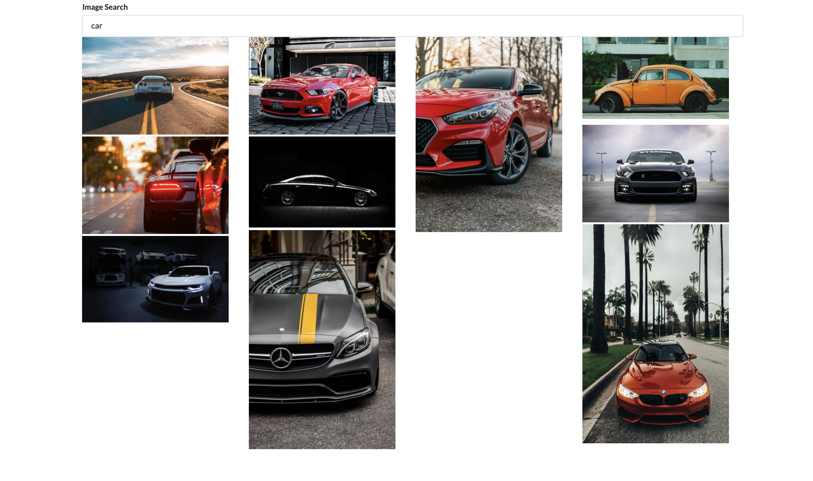
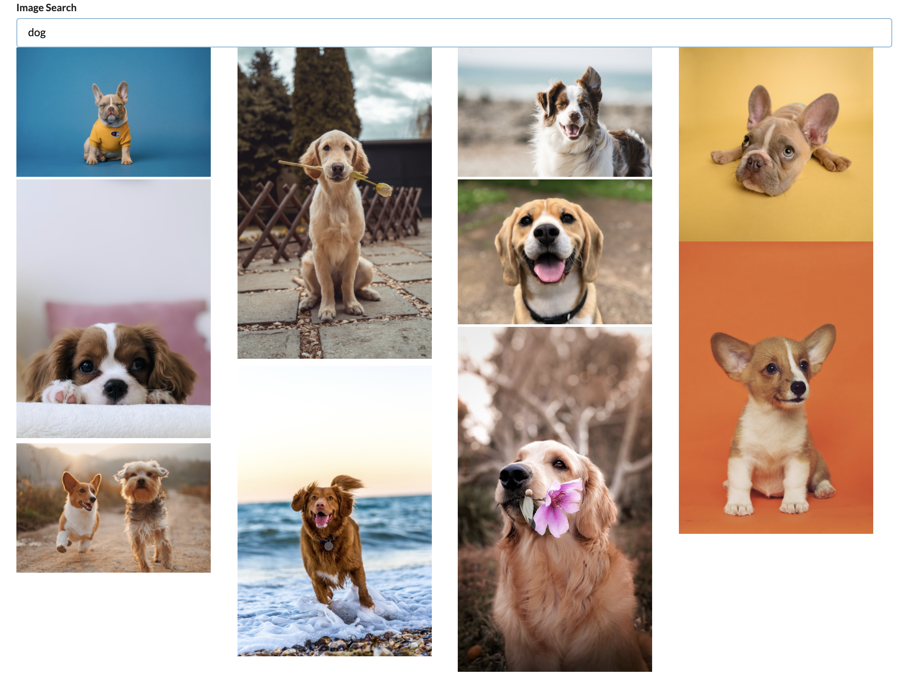

# Image Gallery

## About
 This project was implemented as side project for me to learn more about React, Axios, lifecycle, Class component's pros and cons.

The project serves as a image search-engine where users can search images via [unsplash](unsplash.com/developers)

## Tech Stack
- React
- Axios
- unsplash API

## To-do next
1. Deploy/Host
2. think of coo/fun ideas for further update

## Demo

## Install
1. `git clone SSH`
2. `npm install`
3. `npm start`

Credit

unsplash.com/developers

